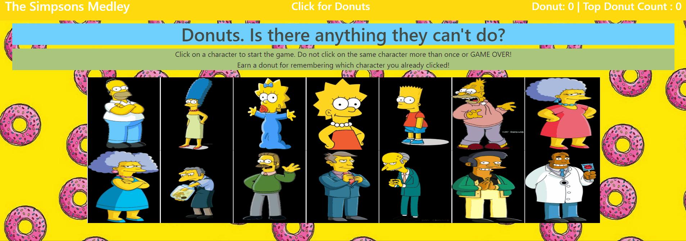

# The Simpsons Clicky Game

### About
This game was created using react and it is a memory game. The objective is to remember all the characters that have already been clicked, and not clicking the same character twice. 

---



---

### Getting Started

* Begin installing Create React App globally by running the following command in your terminal: `npx create-react-app <appname>` where `<appname>` is what you want to name your app. Example: `npx create-react-app practiceapp`.

---

### Code Highlight

The code snippet belows demonstrate how the pictures are shuffled after every click.

```js
  shuffled = newClicked =>{
    for (var i=newClicked.length -1; i>0; i--){
      const j = Math.floor(Math.random() * (i+1))
      const temporary = newClicked[i];
      newClicked[i]= newClicked[j];
      newClicked[j] = temporary
    }
  };
```

---

### Deploy Link

[Live site](https://mtbanh.github.io/Template-Engine)

---
## Authors 
### [Mai Banh](https://github.com/mtbanh)
- [LinkedIn](https://www.linkedin.com/in/banhtmai/)
- [Portfolio]( )

- email: maibanh1996@gmail.com